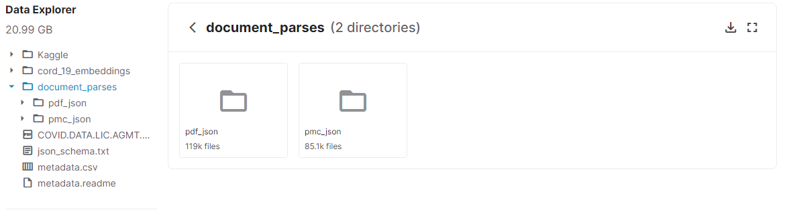

# PhraseBase
This is a really small program, which can be used to quickly search through thousands of different papers for a specific
phrase or expression. 

## Installation
1. Download the papers through which the program will search from [kaggle](https://www.kaggle.com/allen-institute-for-ai/CORD-19-research-challenge?select=document_parses). 


2. unzip the _document_parses.zip_ file. This might take very long, since approximately 200.000 papers are included. Unzipping everything will take up around **20GB** of disk space.
However, you can stop the unziping at any point and only work with a fraction of the papers, e.g. only 10.000 papers.

3. clone the repository to the desired location and create an enviroment which contains all necessary packages
    ```
    git clone https://github.com/nickhir/PhraseBase.git
    cd interactive-digit-recognition
    conda env create -f environment.yml
    conda activate PhraseBase
    ```
   
4. Lastly, modify `path.txt` so that the path points to the directory where the json files are, which you downloaded in step 1.
The path has to look something like this `path/to/the/directory`.


## How to use
Simply run `python phrasebase.py` inside of the `PhraseBase` enviroment. 
Afterwards you can type in the string you are looking for. Regular expressions can be used.
The program will then iterate through ever json file which is located in the path that you specified.
You can stop this process at any time by pressing `ctrl+c` to look at the results.

You can also run `python phrasebase.py --IGNORECASE`, which will ignore subsequently ignore upper/lower case of your input string.

Running `python phrasebase.py --exact` will only return exact matches.

